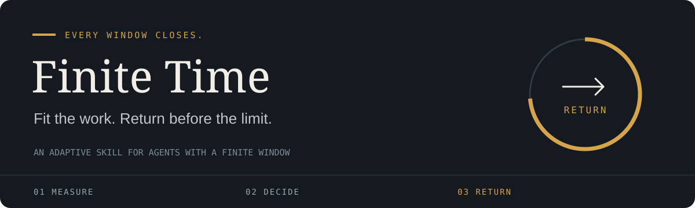

<p align="center">
  
</p>

<p align="center">
  <a href="https://github.com/demidko/finite-time/actions/workflows/check.yml"></a>
  <a href="https://github.com/demidko/finite-time/releases"></a>
  <a href="LICENSE"></a>
  <a href="https://agentskills.io"></a>
</p>

Your working window is real, finite, and already passing. Finite Time brings
that boundary into every choice: what to open, how to fit it, and when to
bring the work back. The real quota and the agent's accounted steps form a
shared clock. The agent reads its live meter itself, in Claude Code and in Codex; otherwise the
owner supplies the displayed number. Each pulse brings the remainder into focus.

**Fit the work. Back by 85.** One phrase steers the whole method: the agent reads the clock, fits
the whole task to the percent you named, lands it committed, and returns.

The method originated with [Fluffball, Twice-Honored Manul](https://github.com/demidko) in work
with Fable. For **Fable 5.1, Astra, and other agents
that follow the Agent Skills format**. It ships one standard-library reader script and
needs no background service.

**At a glance**

- **The clock.** Your rate-limit window, read by the agent itself: Anthropic's usage endpoint in
  Claude Code, `account/rateLimits/read` in Codex. The same number you see on your screen.
- **The command.** One phrase: `back by 85`. The agent brings the whole task in, committed, before
  the mark; what does not fit it says at the opening, never at the return. Your number always wins
  over its count.
- **The lens.** The installed skill rewrites `TIME-LENS.md` to your rhythm after every return.

Jump to: [Why it works](#why-it-works) · [Start in one minute](#start-in-one-minute) ·
[Reading the clock](#reading-the-clock) · [The loop](#the-loop) ·
[A skill that learns your pace](#a-skill-that-learns-your-pace) ·
[Manual installation](#manual-installation) · [References](#references)

## Why it works

### The working record
In Fluffball's documented work with Fable, **100 documentation files became 40**,
an architecture map gained diagrams, and the result was preserved in **five
commits**. **Three stops at clock readings each left a consistent, committed tree.** The
first-round forecast matched to a percentage point; a later forecast miss
became a correction carried into the method.

The Twice-Honored Manul's firsthand account describes Fable making decisions remarkably quickly,
planning its own budget, and giving feedback that helped him direct the work.
The original note places the most precise steps in the final percentage points
of the window. The approaching end became useful pressure on the next choice.

Independent Codex executions exercised the protocol across **nine scripted
quota scenarios**. Three executions produced and verified their requested
files. A subsequent task carried **62% used + 3 estimated points = 65% used**
forward without another intake question. When a new **74% used** pulse replaced
a **68% used** estimate, that edition's agent refused the unit as priced, saved a
checkpoint, and wrote the pacing correction into its lens; the current edition
reprices the unit, folds its write and check into one call, and lands it checked
before **78% used**.

A follow-up pass began with the installation text and reproduced the carried
clock, the stop at the corrected reading that the current edition replaces with
a repricing, and a concise request when the reading was missing.
It saved another checked file and persisted the updated lens.

These records show the method in action: a pulse changes a decision, a committed
tree survives every boundary, and the lesson changes the next run. Read the
[field account and mechanism](docs/method.md) and the
[execution record](evals/validation-2026-10-06.md).

### Research background
finite-time brings research on bounded computation and language models under time and token
constraints into an executable working discipline. The findings below inform its design: make the
boundary present, ground the clock in real readings, price the next step, and return usable work.

The window is not a metric chosen for convenience, and the method is not a timebox imposed by policy.
The rate-limit window is the real boundary of the decision window the human and the agent share.
When it closes, the human's next request is refused as surely as the agent's next call: one event
ends the work for both. The human meets that boundary the way people meet time, in sensation: the
limit arrives, the session is over, the rest of the day goes on without the agent. The agent meets
it as a number read from the provider's meter. Both are perceptions of one objective fact, outside
either of them and indifferent to belief. Nothing in finite-time is added to the session that was
not already governing it; the method makes the true constraint visible to the one participant who
could not see it and binds the agent's decisions to the same reality the human already lives in.
The urgency it produces is grounded in a consequence that will actually occur.

- **Felt urgency sharpens the work.** Wang et al. (2025) show that when a prompt carries urgency,
  language models shorten their reasoning while holding accuracy, and on the harder GPQA set five
  of the six tested models became more accurate; the authors propose that urgency prunes unnecessary
  exploration. Li et al. (2023) found earlier that stakes expressed in a prompt change
  output quality. finite-time supplies real stakes: the owner's actual rate-limit window, read from
  the harness, not a fictional deadline.
- **A visible remainder and felt urgency change decisions.** Sehgal, Guntuku, and Ungar
  (EMNLP 2026) show that explicit remaining-time feedback raised deal closure from 4% to 32% for
  GPT-5.1-chat-latest. Qualitative urgency cues performed even better than numeric countdowns in
  their urgency comparison. Follow-up comparisons distinguish repeated reminders of the original
  total budget, which fell below remaining-time feedback, from directed internal time tracking,
  which helped or hurt depending on the model. finite-time combines the two design levers: the
  clock is grounded in objective time from outside the model, the provider's own meter (Anthropic's
  usage endpoint in Claude Code, `account/rateLimits/read` in Codex) read by `usage.py`, or the
  owner's pulse from that same meter; its immersive language carries the boundary into the next
  decision.
- **Agents misjudge their own budgets.** BAGEN (Lin et al., 2026) measures budget-awareness
  directly: capability and budget-awareness correlate only weakly (r = 0.35), top models stay
  over-optimistic on failing paths, and acting on budget signals saved 28 to 64 percent of the
  tokens spent on those paths. This is why the owner's number overrides the agent's count, why the
  rate is calibrated from readings rather than from the model's self-estimate, and why the next
  atom must pass an admission test before it starts.
- **A committable tree at any stop.** Zhang et al. (ACL 2026 Findings) formalize anytime
  reasoning under token budgets with the Anytime Index, the rate at which solution quality grows
  with spent tokens. Zilberstein (1996) and Russell and Subramanian (1995) laid the classical
  ground: interruptible computation whose state is coherent at every stop, and agents rational
  under bounded resources. Atoms, landing, and the priced return are that discipline applied to a
  coding session.
- **A boundary changes the shape of thinking.** Budget forcing in s1 (Muennighoff et al., 2025)
  controls test-time compute by shortening or extending reasoning; extending it improved math
  accuracy in their experiments. Token-budget prompting in TALE (Han et al., 2025) reduced token
  costs with a slight performance reduction. Together they show that the reasoning budget is an
  actionable control. Parkinson (1955) named the human half: work expands to fill the time available
  for its completion. finite-time inverts it by making the time visible.

## Start in one minute

Install using the [Skills CLI](https://skills.sh/docs/cli):

```sh
npx skills add demidko/finite-time
```

For reliable activation on **every new task**, add the short
always-on instruction below to your agent's persistent
instructions (`AGENTS.md`, `CLAUDE.md`, or the equivalent). This makes the
time picture part of each task's opening across hosts.

```text
Before any task, follow the finite-time skill: read the clock with its usage.py, agree on the
mark in one line, work in atoms, land, return. Let TIME-LENS.md learn our rhythm.
```

Then say what you want and when you want it back:

```text
Move the auth tests to the new fixture. Back by 85.
```

The agent reads the clock itself, prices the whole task, works in atoms, and returns at or before
85% of your window with four lines: done and where, the percent it landed at against the mark, what
its lens learned, and the next step as a choice. If the task does not fit the mark, it says so in
its opening line with the arithmetic, before the first call; after your go, fitting is its job: it
compresses its own process, never your task. Give no mark and it proposes one in a single line;
"ok" is enough. Correct the clock whenever you like ("you're at 62", "make it 80 instead"); your
number always wins.

In Codex the same phrase reads in left terms, or invoke the skill explicitly:

```text
$finite-time Refactor the parser. 29% left; spend up to 2 percentage points.
```

In Claude Code, use `/finite-time`, for example with `62% used; spend up to
8 percentage points`. Other hosts can load
[SKILL.md](skills/finite-time/SKILL.md) directly with `TIME-LENS.md` beside it.

When the agent needs a quota pulse it runs `usage.py`. In Claude Code the script reads the
harness's own OAuth login for the 5-hour and 7-day windows; in Codex it reads the authenticated
app-server meter through `account/rateLimits/read`. Neither spends a model turn, and no token is
printed. The first act of a session is to read the percent; the last act is to read it again.

When no reader works, it asks once, in one line:

> I can't read the weekly window from here. What percent are we at, and back by what?
> One number is the reading and I'll set the mark from it; two numbers are the reading and the mark.

The agent speaks your meter's language, used in Claude, left in Codex, or whatever your display
shows, and never runs two counters: 29% left and two points for the task returns with at least 27%
left; 62% used and eight points returns before 70% used. A usable picture carries across tasks, the
last real reading plus the work counted since it, refreshed when a reading can change a decision
rather than at every task. Your corrections to the mark, the pace, or the order apply before the
next write, and the lens remembers them.

## Reading the clock

| Harness | Limit that counts | How the agent reads it |
| --- | --- | --- |
| Claude Code | rolling 5-hour window, 7-day window behind it | `usage.py` reads the harness's own login; first and last act of a session |
| Codex CLI | weekly limit | `usage.py` asks `codex app-server` for `account/rateLimits/read` |
| Anything else | whatever the owner's display shows | asks once, in one line, together with the mark |

Both readers return the provider's own meter: objective time from outside the model, the same
number the owner sees in the harness.

Between readings the agent counts its own tool calls and its workers' runs. That count is a proxy
for what the provider bills, the readings price it, and a rounded meter prices it as a range. The
skill text keeps this arithmetic to what changes a decision: its sentences exist to govern the
agent's conduct inside the window, and the objective account of the meter belongs here, in the
documentation written for you.

## The loop

| You supply | The agent does |
| --- | --- |
| `Back by 85` | Fits the whole task before 85% used, lands it committed, and returns, the return priced in. |
| Codex task with an available live meter | Reads the actual quota and reset itself, without asking you to copy the number. |
| Codex: `29% left; spend two points` | Returns with at least 27% left, including closure. |
| Claude: `62% used; spend eight points` | Returns before 70% used, including closure. |
| `Return with at least 22% left` | Keeps 22% left as the return floor. |
| `Return before 78% used` | Keeps 78% used as the return ceiling. |
| Only the current reading | Prices the whole task and proposes the mark from it in one line; "ok" makes it the mark. |
| A new pulse during work | Reprices the rest and compresses its own process to fit; the scope stays yours. |
| An observed miss or correction | Rewrites the installed time lens for the next session. |

The final ten points of a full window belong to the owner by default. An earlier
target takes precedence: **38% left → 22% left gives 16 gross points.** Verification,
saving, and the return message must also fit before the target. The owner can
explicitly change or release the reserve.

The agent measures cost through useful work, protects coherent checkpoints, and
folds its own process tighter as the end of the window nears: fewer turns,
cheaper executors, nothing opened that the plan did not price. It returns when
the task is done; the unused window remains yours.

## A skill that learns your pace

[The time lens](skills/finite-time/TIME-LENS.md) is a writable part of
the installed skill. Your first comparable pulses establish its local rates.
Each governed session folds experience back into this file: cost ranges, suitable unit sizes,
closure overhead, decision habits, and your preferred rhythm.

The agent **rewrites** compact rules instead of appending a diary. The shared
protocol stays stable while its personal application changes. A model switch
or a new window makes old rates provisional. A read-only host can use persistent
owner-local memory or return a lens patch for manual saving.

Back up your personalized lens before reinstalling or updating. Restore it over
the new seed afterward. Keep personal observations out of upstream pull requests.

## Manual installation

First installation:

```sh
git clone https://github.com/demidko/finite-time.git
mkdir -p ~/.agents/skills
cp -R finite-time/skills/finite-time ~/.agents/skills/finite-time
```

For Claude Code, use `~/.claude/skills` instead. A project-local copy can go in
`.agents/skills` or `.claude/skills`. Use one discovery path per host to avoid
duplicate entries. Then add the always-on instruction above.

These locations follow the official [Codex skill documentation](https://learn.chatgpt.com/docs/build-skills)
and [Claude Code skill documentation](https://code.claude.com/docs/en/skills).
Each edition is tagged; `python3 scripts/package.py` builds the installable ZIP.
Versions use the edition date: `YYYY-MM-DD`; another edition that day adds `.2`, `.3`, and so on.

The installed skill is deliberately flat:

```text
finite-time/
├── SKILL.md       The shared protocol and its immersive time framing
├── TIME-LENS.md   The owner's evolving calibration and rhythm
├── usage.py       Reads the clock: Claude Code's windows or Codex's live quota
└── LICENSE
```

The only runtime script is `usage.py`, standard library only. Human documentation,
evaluation cases, and release tooling stay in this repository.

## References

1. Wang, M., Bai, Y., Vu, T.-T., Shareghi, E., & Haffari, G. (2025). *Discrete Minds in a
   Continuous World: Do Language Models Know Time Passes?* arXiv:2506.05790.
   https://arxiv.org/abs/2506.05790
2. Sehgal, N. K. R., Guntuku, S. C., & Ungar, L. (2026). *Real-Time Deadlines Reveal Fragile
   Temporal Adaptation in LLM Strategic Dialogues.* Proceedings of EMNLP 2026. arXiv:2601.13206.
   https://arxiv.org/abs/2601.13206
3. Lin, Y., Wang, Z., Liu, M., Shan, Y., Bai, L., Zhang, J., Jin, X., Chen, B., Su, J., Wang, X.,
   Pei, J., & Li, M. (2026). *BAGEN: Are LLM Agents Budget-Aware?* arXiv:2606.00198.
   https://arxiv.org/abs/2606.00198
4. Zhang, X., Ashrafi, S., Mirsaidova, A., Rezaeian, A. H., Ballesteros, M., Chilton, L. B.,
   Yu, Z., & Roth, D. (2026). *Budget-Aware Anytime Reasoning with LLM-Synthesized Preference
   Data.* Findings of ACL 2026. arXiv:2601.11038. https://arxiv.org/abs/2601.11038
5. Muennighoff, N., Yang, Z., Shi, W., Li, X. L., Fei-Fei, L., Hajishirzi, H., Zettlemoyer, L.,
   Liang, P., Candès, E., & Hashimoto, T. (2025). *s1: Simple test-time scaling.*
   arXiv:2501.19393. https://arxiv.org/abs/2501.19393
6. Han, T., Wang, Z., Fang, C., Zhao, S., Ma, S., & Chen, Z. (2025). *Token-Budget-Aware LLM
   Reasoning.* Findings of ACL 2025. arXiv:2412.18547. https://arxiv.org/abs/2412.18547
7. Li, C., Wang, J., Zhang, Y., Zhu, K., Hou, W., Lian, J., Luo, F., Yang, Q., & Xie, X. (2023).
   *Large Language Models Understand and Can Be Enhanced by Emotional Stimuli.*
   arXiv:2307.11760. https://arxiv.org/abs/2307.11760
8. Zilberstein, S. (1996). Using Anytime Algorithms in Intelligent Systems. *AI Magazine*,
   17(3), 73-83. https://doi.org/10.1609/aimag.v17i3.1232
9. Russell, S. J., & Subramanian, D. (1995). Provably Bounded-Optimal Agents. *Journal of
   Artificial Intelligence Research*, 2, 575-609. https://doi.org/10.1613/jair.133
10. Parkinson, C. N. (1955, November 19). Parkinson's Law. *The Economist.*

## Work inside the window

Keep the closing boundary present while the work is still taking shape. Bring
the whole task in, price each step to fit, and leave room for the return. Let the owner's next pulse correct the clock
and the next finished unit refine the lens.

**What you open now must fit all the way through your return.**

- [Read the actual skill](skills/finite-time/SKILL.md)
- [Understand the method and its origin](docs/method.md)
- [Inspect examples](docs/examples.md)
- [Contribute a field result](CONTRIBUTING.md)

Created by Fluffball, Twice-Honored Manul. Concept developed with Fable; two independent skill editions
prepared with Astra and with Fable, merged after a six-perspective Fable review and Astra's behavioral rehearsals. Released under the [MIT license](LICENSE).
